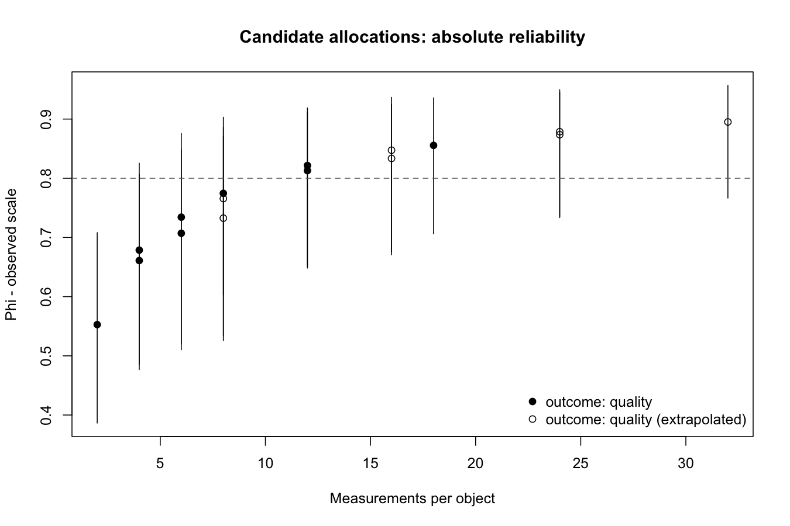
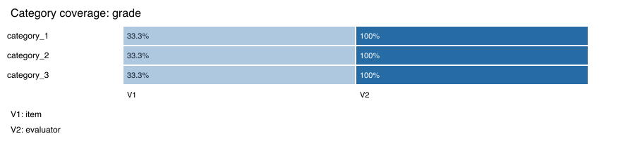

# Figures for inspecting and reporting a G study

The development package provides base-R displays for data profiles and results. They draw retained
data checks or calculated coefficients and never run an optimizer. All examples
below use objects from the installed `LLM-workflow` vignette.

## Panel audit

```r
plot(preflight, type = "cells")
plot(preflight, type = "sources")
preflight$panel_audit$missing_cells
preflight$panel_audit$replication_issues
```

The cell view separates cells at the declared replication from missing cells
and cells with too few or too many rows. Counts refer to the Cartesian product
of observed coded levels, including parent-scoped nested codes. A level absent
from every record cannot be inferred. The source view shows random-effect
dimensions; this is not predicted runtime or peak memory. Large source lists
are explicitly capped. Neither plot establishes identification or fit quality.

## Outcome category coverage

```r
profile <- gt_preflight(data, "label", design, gt_family("binary"))
profile$outcome_profile$label$categories
profile$outcome_profile$label$by_variable
plot(profile, type = "outcomes", outcome = "label")
```

The heatmap shows category representation across groups, not the proportion of
individual responses in that category. Read the category table for response
frequencies. Groups with no observed variation include groups with one record;
these are reported separately. The display caps large sets and labels any
truncation. Gaussian outcomes have numerical summaries rather than category
heatmaps. These views provide no threshold for adequate information and do not
modify the data or the fitting rules.

## Reliability forest plot

```r
plot(reliability, target = 0.80)
plot(reliability, coefficient = "Phi", interval = FALSE)
```

Each outcome and any explicitly weighted composite is labelled separately.
Points show relative G (`Erho2`) and absolute Phi. Segments show available
estimation intervals. An absent interval stays absent, and the subtitle names
conditional inference or extrapolation where applicable. The scale is always
shown: binary/ordinal latent-response coefficients are not observed-score or
majority-vote reliability. The dashed target is descriptive.

## Decision-study allocation plot

```r
plot(dstudy, coefficient = "Phi", outcome = "quality", target = 0.80)
screen <- gt_dstudy_target(dstudy, target = 0.80, coefficient = "Phi",
  outcome = "quality")
screen[screen$fewest_measurements %in% TRUE, ]
```

Points compare the supplied allocations against total measurements per object.
Extrapolated counts are distinguished, and intervals are drawn only where
available. Equal measurement totals can represent different allocations;
points are not connected into an assumed smooth relationship. Screening uses
point estimates, retains all ties, and identifies only the best measurement
count within the supplied candidates. It supplies neither a global optimum nor
a guarantee about new panels. Costs per evaluator or API call are not modeled.

## Save figures and tables

```r
pdf("reliability.pdf", width = 8, height = 5)
plot(reliability, target = 0.80)
dev.off()
png("decision-study.png", width = 1200, height = 850, res = 150)
plot(dstudy, coefficient = "Phi", outcome = "quality", target = 0.80)
dev.off()
write.csv(as.data.frame(reliability), "reliability.csv", row.names = FALSE)
write.csv(as.data.frame(dstudy), "decision-study.csv", row.names = FALSE)
```

CSV exports retain scalar columns for scale, interval availability, conditional
uncertainty and extrapolation. Allocation columns have a prefix to protect
result fields from arbitrary facet names. The data frame's `allocation_columns`
attribute maps exported names to their original facet names; attributes are
available in R and are not preserved by CSV.

The executable gallery is `examples/visualization_workflow.R`. Its figures use
synthetic continuous judgments with declared source distributions. They
illustrate reporting and cannot establish an adequate real-study design.
The rendered gallery provides [panel](figures/usability-030/panel-audit.png),
[source](figures/usability-030/source-dimensions.png),
[reliability](figures/usability-030/reliability.png) and
[allocation](figures/usability-030/decision-study.png) views; [coefficient](figures/usability-030/reliability.csv),
[allocation](figures/usability-030/decision-study.csv) and
[target-screening](figures/usability-030/target-screen.csv) tables retain the
numbers used in the examples.



Run the gallery into a new directory to reproduce its figures and tables.
The combined PDF is generated locally; PNG previews and CSV tables are
checked in for public use:

```sh
Rscript --vanilla examples/visualization_workflow.R /tmp/gtheory-figures-new
```

The [real-data workflow](REAL_DATA_WORKFLOW.md) separately audits native
annotation panels; full native sparse fitting remains subject to the
[0.3.0 qualification gates](ROADMAP.md).


The [portable report](ANALYSIS_REPORT.md) collects available figures with their
result tables, model context and diagnostic limitations in one offline HTML
file.




This synthetic ordinal example uses explicitly fixed zero covariance components.
The figure describes category representation across groups, not fitted reliability.
