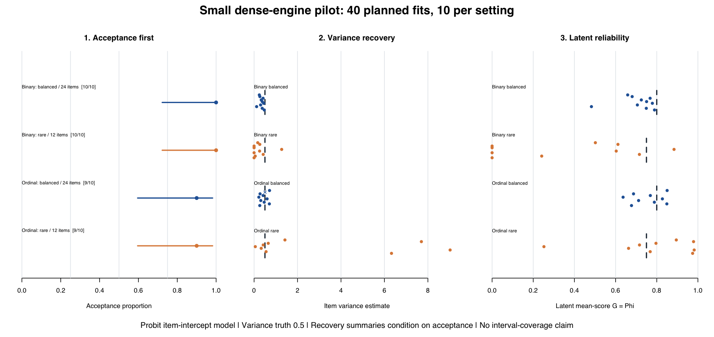

# Small binary/ordinal usability and recovery pilot

Forty predeclared synthetic panels examine acceptance and point recovery under
the **public dense** 0.3.0.9000 development engine: binary and three-category
ordinal probit, each in a balanced/more-item and rare/fewer-item setting.
This is a small usability pilot, not sparse qualification or evidence of a
validated operating range. No parameter-interval coverage is claimed.

The single run completed all 40 fits in 11.70 seconds: **38 accepted**, one
ordinal-balanced numerical rejection, and one ordinal-rare error because the
high category was absent. Acceptance was 10/10 for both binary settings and
9/10 for both ordinal settings; each interval remains wide with only ten
attempts. Four accepted rare-binary fits estimated zero item variance. Among
accepted fits, rare-binary latent-reliability bias was −0.394 (MCSE 0.109),
and rare-ordinal variance RMSE was 4.210 (MCSE 1.110), against variance truth
0.5. High numerical acceptance therefore did not ensure close recovery here.

Read the [predeclared protocol](PROTOCOL.md) and [configuration](config.csv).
The [executed results](results/RESULTS.md) report acceptance first, with
Monte Carlo uncertainty and conditional recovery denominators. Every planned
attempt, including failures or unstarted work, is in
[attempts.csv](results/attempts.csv). The [execution record](results/execution.json)
and [pre-fit freeze](results/prefit-freeze.json) identify timing, frozen panels,
source archive and source fingerprints. No published release was modified.



Reproduce from the repository root with an installed copy of the intended
development archive and a new, empty output directory:

```sh
python3 validation-studies/discrete-030-usability-pilot/run.py \
  --library /path/to/isolated-library \
  --archive /path/to/Gtheory4LLM_0.3.0.9000.tar.gz \
  --output /private/tmp/discrete-usability-new
```

The runner enforces 10 seconds per fit subprocess and 450 seconds overall.
Generated panels are frozen before fitting, independent of the package's
numerical implementation. No missing category, rejection, boundary estimate
or timeout is replaced. There is no automatic rerun in package tests or CI.
The archive fingerprint identifies the tested snapshot; a later checkout may
also contain reporting changes, which do not retroactively change this run.

A [rendering-only amendment](RENDERING_AMENDMENT.md) repaired the local PNG
device after the campaign; all original scripts and logs remain available,
and no panel was refitted. PNG and PDF exports were produced, and the PNG was visually checked.


The [public evidence inventory](PUBLICATION_NOTE.md) distinguishes checked-in
CSV/PNG evidence from locally retained RDS, PDF and log files, and records the
single filesystem-location redaction in the environment record.
